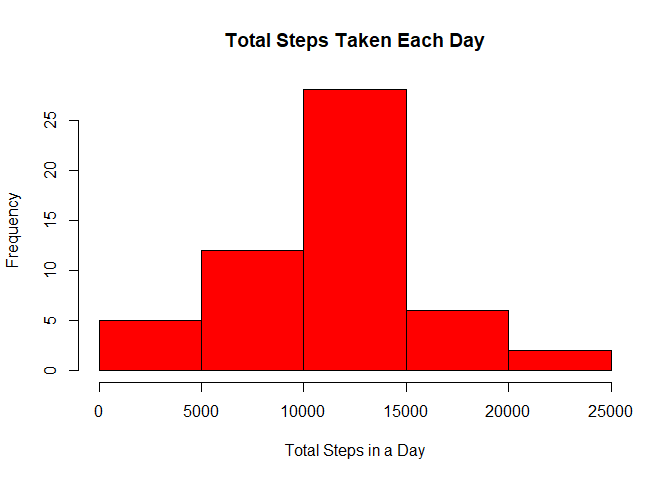
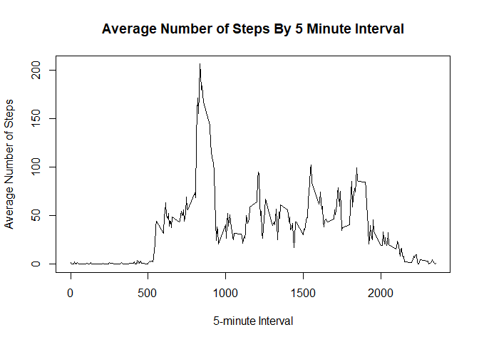
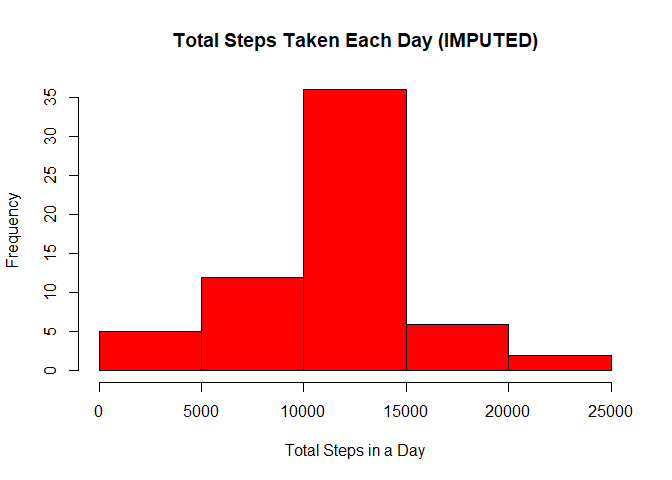
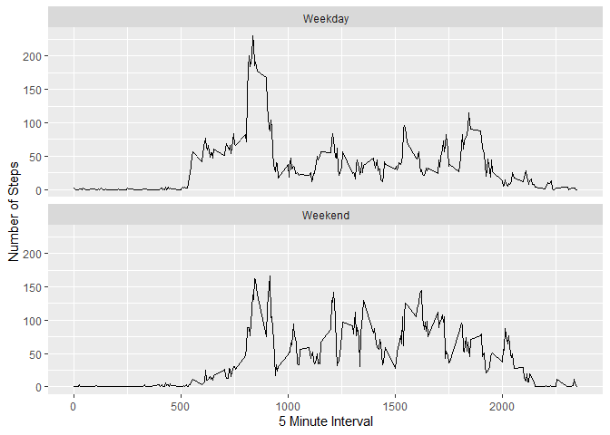

    #read the csv file
    data<-read.csv("activity.csv")
    #date is stored as char, change to date type
    data$date<-as.Date(data$date)
    #calculate total steps each day
    totalperday<-aggregate(data$steps, list(data$date), FUN=sum)

## Histogram of the total number of steps taken each day

    #plot histogram
    hist(totalperday$x, main="Total Steps Taken Each Day", xlab="Total Steps in a Day", col="red", border="black")

## Mean

     mean(totalperday$x, na.rm=TRUE)

    ## [1] 10766.19

## Median

    median(totalperday$x, na.rm=TRUE)

    ## [1] 10765

## Time Series Plot of the 5-Minute interval

    #calculate average steps across all days
    avg_steps_interval<-aggregate(steps~interval, data, FUN=mean)
    #plot the graph
    plot(avg_steps_interval$interval, avg_steps_interval$steps, type="l", main="Average Number of Steps By 5 Minute Interval",xlab="5-minute Interval",ylab="Average Number of Steps")

## 5-Minute interval with the maximum number of steps

    max_index<-which.max(avg_steps_interval$steps)
    avg_steps_interval[max_index,]

    ##     interval    steps
    ## 104      835 206.1698

# Imputing missing values

## Total number of missing values in the dataset is

    sum(is.na(data$steps))

    ## [1] 2304

## Filling in NAs with the mean of that 5 minute interval value

    #use for loop to overwrite NAs with the mean of that 5 minute interval.
    for (i in 1:nrow(data)){
      if(is.na(data$steps[i])){
        data$steps[i]<-avg_steps_interval$steps[which(avg_steps_interval$interval==data$interval[i])]
       }
    }

    #aggregate the steps taken each day with the new imputed data
    totalperday_impute<-aggregate (steps~date, data, sum)

    #plot the histogram with Imputed data, after filling in missing valuse (NAs)
    hist(totalperday_impute$steps, main="Total Steps Taken Each Day (IMPUTED)", xlab="Total Steps in a Day", col="red", border="black")

## Mean after imputing missing values

     mean(totalperday_impute$steps)

    ## [1] 10766.19

## Median after imputing missing values

    median(totalperday_impute$steps)

    ## [1] 10766.19

Mean stays the same at 10766.19 but mean has changed slightly from 10765
to 10766.19

    #adding a day vector that specifies the day of the week
    data$day<-weekdays(data$date)
    #converting day to either weekday or weekend
    for (i in 1:nrow(data)){
      if (data$day[i] %in% c("Monday", "Tuesday","Wednesday", "Thursday", "Friday"))
        data$day[i]<-"Weekday"
        
      else (data$day[i]<-"Weekend")
    }

## Panel Plot of 5 minute interval and average number of steps taken across all weekdays and weekends

    #calculate mean of steps over weekday and weekend
    avg_steps_weekday<-aggregate(steps~interval+day, data, FUN=mean)

    library(ggplot2)
    qplot(interval, steps, data=avg_steps_weekday,geom=c("line"),ylab="Number of Steps", xlab="5 Minute Interval")+facet_wrap(~day, ncol=1)

    ## Warning: `qplot()` was deprecated in ggplot2 3.4.0.

